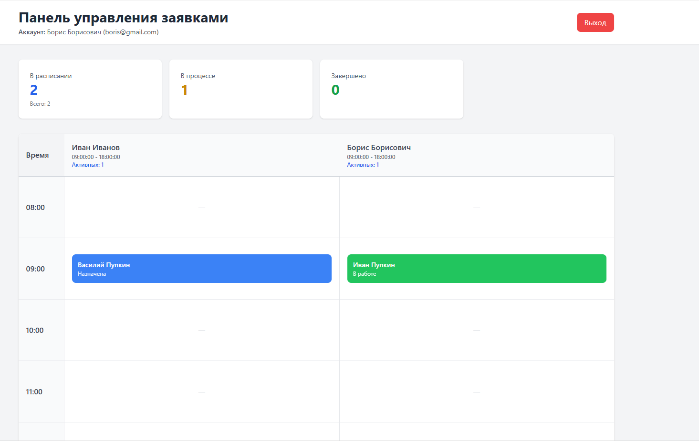
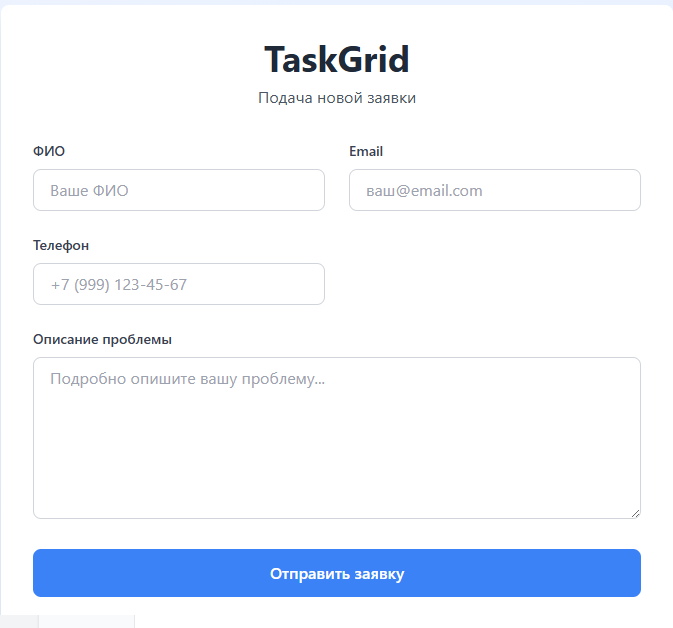

# TaskGrid - Система управления заявками

---

##  Описание проекта

**TaskGrid** - это Full Stack веб-приложение для автоматизации управления заявками клиентов. Система позволяет клиентам оставлять заявки через публичную форму, а затем автоматически распределяет их между сотрудниками на основе их текущей загруженности и рабочего времени.

### Основные возможности

- **Публичная форма заявок** - Клиенты могут оставлять заявки без регистрации
- **Панель управления в реальном времени** - Интерактивная таблица с расписанием сотрудников
- **Аутентификация и авторизация** - JWT токены для безопасного доступа
- **Регистрация сотрудников** - Самостоятельная регистрация новых сотрудников
- **Управление статусами** - Сотрудники могут обновлять статус своих заявок
- **Цветовая кодировка** - Визуальное отображение статусов заявок

---

### Backend
- **Java 17**
- **Spring Boot 3.3**
- **Spring Security**
- **JWT**
- **Spring Data JPA**
- **PostgreSQL**
- **Maven**

### Frontend
- **Angular 17** 

 